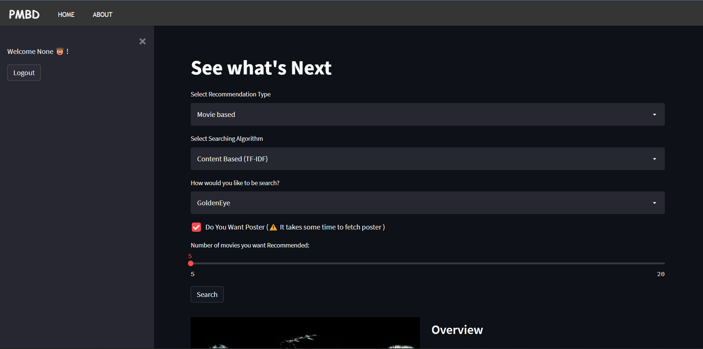

# Recommendation System
Unsupervised Learning Project

Data Preprocessing Code : <a href="https://github.com/prashant-smart/recommendation-system-notebook/blob/main/data_preprocessing.ipynb">Data Preprocessing</a>

### Three Recommendation Type:
<ul>
  <li>Section A: Movie based</li>
  <li>Section B: Person based(cast Member)</li>
  <li>Section C: genres based</li>
</ul>

## Section A: Movie based

In this, a user can select the number of recommendations they want related to a specific movie selected by the movie name.

### Four Algorithm Type:
<ul>
  <li>Section A.1: Content Based (TF-IDF)</li>
  <li>Section A.2: Content Based (Bag Of Words)</li>
  <li>Section A.3: Item-Item Collaborative Based</li>
  <li>Section A.4: K Nearest Neighbor (Item Based)</li>
</ul>

### Section A.1: Content Based (TF-IDF)

This algorithm uses TfidfVectorizer for vector conversion and Cosine Similarity for calculating the angle between two vectors. On the basis of the movie name selected by the user, this algorithm retruns a list of movies sorted in descending order with respect to similarity, which is taken from the similarity matrix (which contains similarity score for each movie).

Code: <a href="https://github.com/prashant-smart/recommendation-system-notebook/blob/main/content_based_filtering.ipynb">Content Based Filtering.ipynb</a>

### Section A.2: Content Based (Bag Of Words)

Bag of Words uses the same technique as TF-IDF, but the score is calculated based on the frequency of the most repetitive words in the movie's content, and the similarity score is calculated in the same way as in TF-IDF.

Code: <a href="https://github.com/prashant-smart/recommendation-system-notebook/blob/main/content_based_filtering.ipynb">Content Based Filtering.ipynb</a>

### Section A.3: Item-Item Collaborative Based

In this algorithm, a user rating for a specific movie is calculated on the basis of how other user rate same movie, and by taking some real time rartings, we can show recommendations to users.

Code: <a href="https://github.com/prashant-smart/recommendation-system-notebook/blob/main/collaborative_item_to_item_filtering.ipynb">Collaborative Item To Ttem Filtering.ipynb</a>

### Section A.4: K Nearest Neighbor (Item Based)

User ratings are predicted here same as in Item-Item Collaborative filtering, but for calculating distance it uses euclidean and manhattan distance between two vectors, and according to that, forms a similarity matrix, then shows recommendations to the user with respect to a specific movie which is selected by the user.

Code: <a href="https://github.com/prashant-smart/recommendation-system-notebook/blob/main/knearestneighbor_algo.ipynb">Kth Nearest Neighbor.ipynb</a>

## Section B: Person based(cast Member)

Users can also get recommendations on the basis of a person who has appeared in movies as a lead actor or director.

First, all movies in which that person is cast as an actor or director are sorted in reverse order according to the average rating and if the number of recommendations is greater than that person's movies, then the user gets recommendation on the basis of the first movie which is going to be recommended first to the user.

Code: <a href="https://github.com/prashant-smart/recommendation-system-notebook/blob/main/cast_based_serach_.ipynb">Cast Based Search.ipynb</a>

## Section C: genres based

This recommendation is based on those movies which have the same genres as selected by the user and then sorted in reverse order according to average ratings of each movie.

Code: <a href="https://github.com/prashant-smart/recommendation-system-notebook/blob/main/generes_based_search.ipynb">Generes Based Search.ipynb</a>

# Installation

`cd .\Recommendation-system\`

`pip install -r requirements.txt`

# Set Up

`streamlit run main.py`

